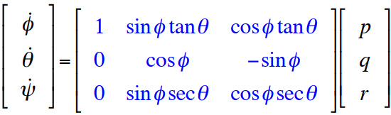
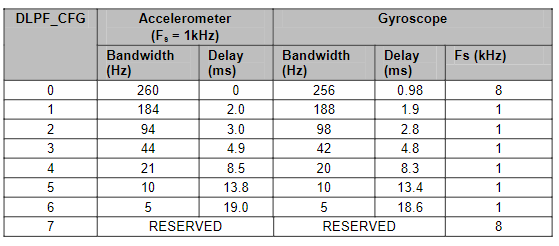

# Calculating the angles from gyroscope
1. Read gyro_readings from MPU sensor
1. Normalize the readings according to selected range
1. convert these body rates to eular rates
1. integrate angles with respect to the time

---
# Q: If the Sensor is surrounded by a noisy environment, what type of filter could used and what is the recommended cutoff frequency depending on the sensor datasheet? 
- Low pass filter with cut-off frequency ranging from 260-5 Hz based on how much delay you want

